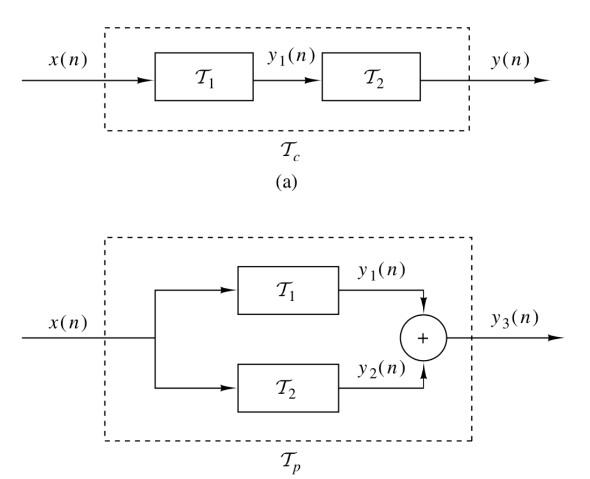
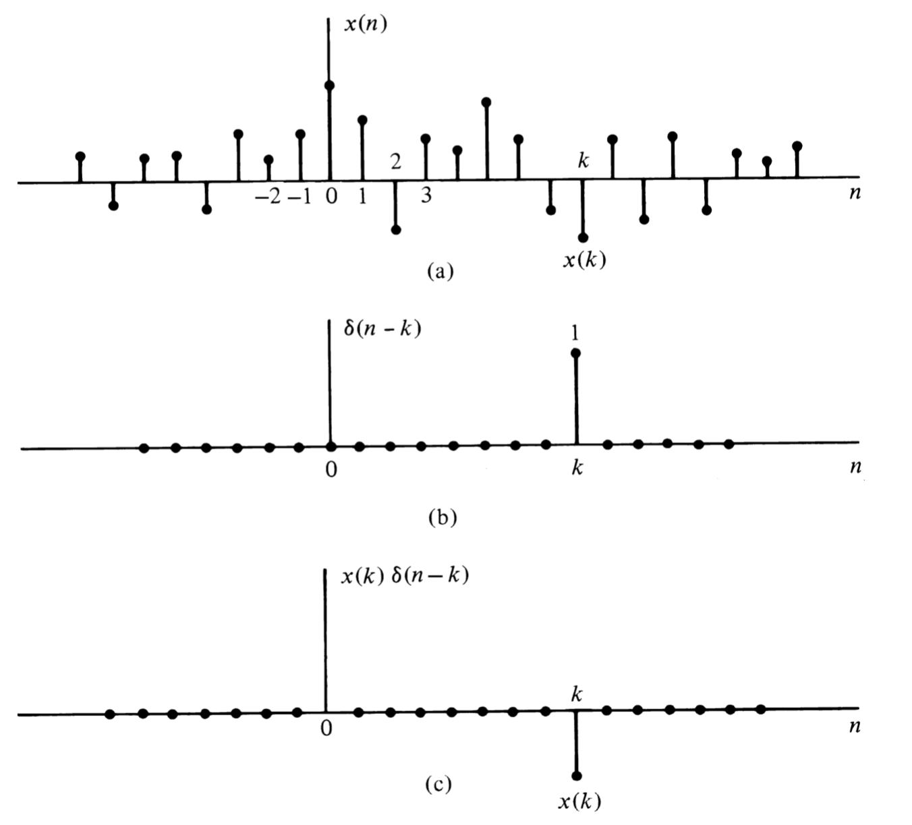
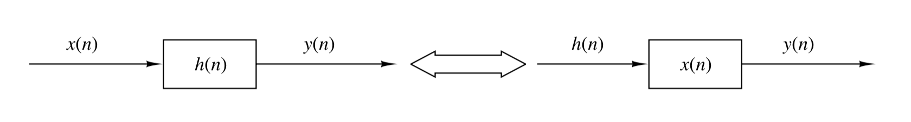
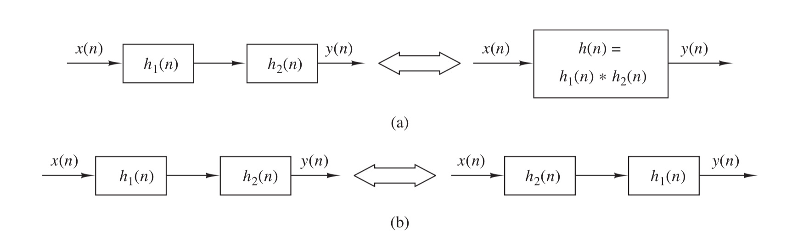
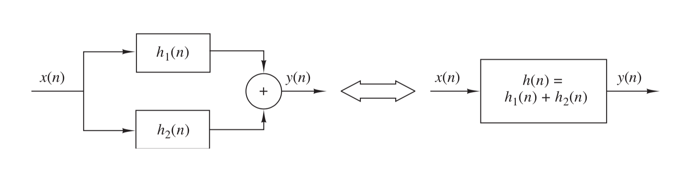
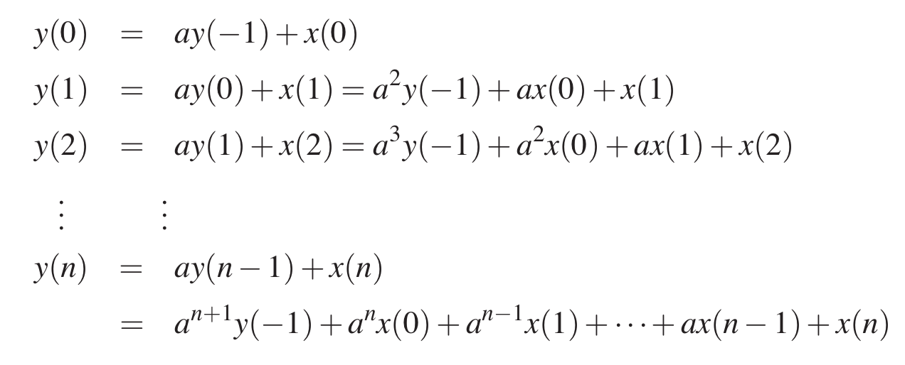
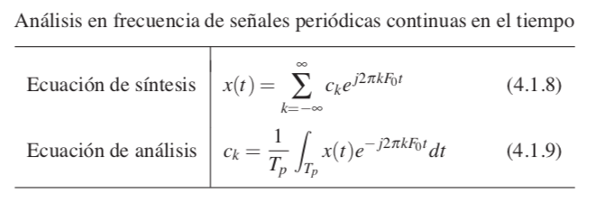
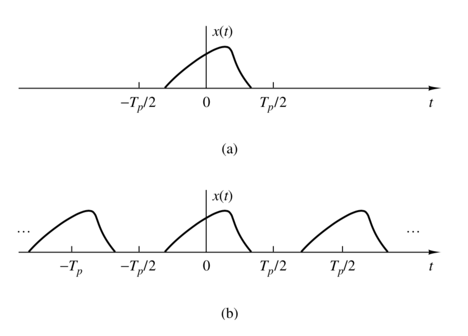

# Apunte Señales y Sistemas I
Por: Tomás Rojas

# Señales, sistemas y procesamiento de señales

> Definición: Una __señal__ es cualquier cantidad física que varia en el tiempo, en el espacio o cualquier otra variable.

Algunos ejemplos de señales pueden ser polinomios que dependan del tiempo o del espacio o cualquier cosa.

Hay señales que pueden ser especificadas de manera funcional (con funciones), pero este no es siempre el caso.

Si tomamos un audio de una charla, no es una señal definida funcionalmente, pero podemos descomponerla en suma de senos y cosenos:

$$\sum_{i=1}^NA_i(t)\sin[2\pi F_i(t)t+\theta_i(t)]$$

Donde $\{A_i\},\{F_i\},\{\theta_i\}$ son conjuntos de Amplitudes, Frecuencias y Fases respectivamente, que bien podrían variar en el tiempo.

Otro ejemplo de señal puede ser un electrocardiograma. Esta señal le entrega información a un médico sobre la condición en que se encuentra el corazón de su paciente. De manera similar, un electroencefalograma da información de la actividad cerebral.

Todos los sistemas mencionados son ejemplos de sistemas que dependen se solo una variable independiente, el tiempo... Un ejemplo de un sistema con más variables independientes puede ser una imagen.

Un sistema también puede ser definido como un aparato físico que ejecuta cierta operación sobre una señal. Por ejemplo un filtro puede ser tratado como un sistema.

Cuando pasamos una señal por un sistema, decimos que la procesamos. En general, un sistema está caracterizado por el tipo de operación que aplica a una señal.

## Clasificación de señales
> lo voy a dejar en blanco ya que no es tan importante para el C1, más adelante volveré a llenar esto

## Señales en tiempo continuo versus señales en tiempo discreto

### Señales sinusoidales continuas

Un oscilador armónico simple puede ser descrito matemáticamente como:

$$x_a(t)=A\cos(\Omega t + \theta); \quad -\infty<t<\infty$$

El subíndice $a$ hace referencia a que esta señal es analógica.

La frecuencia $\Omega$ es frecuencia angular, en radianes, es común usar $F$ que es en Hertz, donde $\Omega=2\pi F$

La señal sinusoidal analógica está caracterizada por las siguientes propiedades:

  + _Para cualquier valor fijo de frecuencia $F$, $x_a(t)$ es periódica._ Esto es
  $$x_a(t+T_p)=x_a(t), \quad T=1/F$$
  + _Señales análogas sinusoidales con distintas frecuencias, __son__ distintas_.
  + _Incrementar la frecuencia implica incrementar las oscilaciones de una señal en un tiempo dado._

Podemos notar que para $F\to 0$ entonces $F \to \infty$

### Señales sinusoidales discretas

Podemos expresar matemáticamente una señal sinusoidal discreta de la siguiente manera:

$$x(n)=A\cos(\omega n + \theta); \quad -\infty<n<\infty$$

Acá también tenemos otra frecuencia:

$$\omega \equiv 2\pi f$$

Podemos ver las siguientes propiedades de este tipo de señales:

  + _Una señal sinusoidal discreta es periódica __solo__ si su frecuencia $f$ es un nro racional_.

Por definición tenemos que una señal discreta es periódica con periodo $N \quad (N>0)$  ssi:
$$x(n+N)=x(n)\quad \forall n$$

El valor más pequeño de $N$ para el que esto se cumple, se llama _periodo fundamental_.

> __Demostración:__
> $$\cos[2\pi f_0(N+n)+\theta]=\cos(2\pi f_0n+\theta)$$
> $$2\pi f_0 N =2k\pi$$
> $$f_0=\frac{k}{N}$$

Por lo que es periódica sólo si su frecuencia $f_0$ es una fracción entre dos enteros i.e. es racional.

  + _Sinusoides discretas cuyas frecuencias están separadas por un múltiplo entero de $2\pi$ son __indénticas__._

Para probar esto, consideremos $\cos(\omega_0n+\theta)$
$$\cos[(\omega_0 +2\pi)n+\theta]=\cos (\omega_0 n + 2\pi +\theta)= \cos(\omega_0n+\theta)$$

Como consecuencia de esto, __todas__ las secuencias sinusoidales que cumplan:

$$x_k(n)=A\cos(\omega_k n+\theta); \quad k=0,1,2,3,...$$

Donde:

$$\omega k =\omega_0+2k\pi, \quad -\pi \leq \omega_0 \leq \pi$$

Son __indistinguibles__, por lo mismo, nos interesan frecuencias en los rangos $-\pi \leq \omega \leq\pi$ o bien $-1/2\leq f\leq1/2$

  + _La oscilación más rápida que puede tener una señal sinusoidal discreta es cuando $\omega=\pm\pi$ o bien $f=\pm 1/2$

En la siguiente imagen podemos ver la señal $x(n)=\cos\omega_0n$ con distintos valores para $\omega_0$

__Figura 1:__ Imagen sacada de _Digital Signal Processing_

## Analógico a digital y digital a analógico

Muchas señales de interés son analógicas. Para procesar una señal analógica de manera digital, primero hay que digitalizarla.

> Esto tampoco es pertinente para el C1, por lo que lo dejaré para después

### Teorema del muestreo

Si tenemos una señal analógica ¿Como encontramos la frecuencia de muestreo $F_s$? Para responder esta pregunta es necesario conocer ciertas características de la señal de interés. En particular, tenemos que tener ciertas nociones del _contenido frecuencial_ de la señal. Por lo general podemos conocer esa información en forma de cotas superiores.

Supongamos que cualquier señal analógica puede ser representada como un suma de senos (Fourier se encarga de eso).

$$x_a(t)=\sum_{i=1}^NA_i\cos(2\pi F_it+\theta_i)$$

Donde $N$ es el número de frecuencias presentes.

El teorema nos dice que (se viene golazo, pero en virtud del tiempo lo voy a plantear no más, en todo caso es fácil de ver que tiene que ver con el aliasing de las señales al tomar mal la frecuencia de muestreo) $F_s>2F_{\text{max}}$

Donde $F_{\text{max}}$ es la frecuencia más alta presente en la señal.

Usando esto, cualquier componente de frecuencia $|F_i|<F_{\text{max}}$, en analógica, pasa a ser una señal sinusoidal discreta con una frecuencia:

$$-\frac{1}{2}\leq f_i=\frac{F_i}{F_s}\leq \frac{1}{2}$$

o de manera equivalente:

$$-\pi\leq \omega_i=2\pi f_i\leq \pi$$
Como $|f|=1/2$ o $|\omega|=\pi$ son las frecuencias más altas en tiempo discreto, si escogemos el muestreo como se mostró, se evita el problema del aliasing.

Así la condición $F_s>2F_{\text{max}}$ garantiza que el mapeo de frecuencias continuas pase con relación 1 a 1 al dominio discreto.

__Teorema del muestreo:__
Si la frecuencia más alta contenida en una señal analógica $x_a(t)$ es $F_{\text{max}}=B$ y la señal se muestrea de tal manera que $F_s>2B$, entonces $x_a(t)$ puede ser recuperada con la función interpolación

$$g(t)=\frac{\sin2\pi B t}{2\pi B t}$$

Así $x_a(t)$ puede ser expresada como:

$$x_a(t)=\sum_{n=-\infty}^\infty x_a\left(\frac{n}{2B}\right)\frac{\sin[ 2 \pi B(t-n/2B)]}{2 \pi B(t-n/2B)}$$

>TODO: Falta poner un par de imágenes

# Señales y sistemas en tiempo discreto

En esta sección se ven mucho los sistemas LTI, tema central del curso.

## Señales en tiempo discreto
Una señal en tiempo discreto $x(n)$ es una función de una variable independiente que es un entero. Como muestra la _figura 2_, la señal __no está definida__ para valores de $n$ que no sean enteros (ni siquiera es 0).

__Figura 2__

## Señales elementales en tiempo discreto

#### 1.- Muestra unitaria

Es una señal que es 1 en 0 pero 0 en todo lo demás

$$\delta(n)=
\begin{cases}
  1, &\quad \text{para } n=0\\
  0, &\quad \text{para } n\neq0
\end{cases}
$$

#### 2.- Señal escalón unitario

$$
u(n)=
\begin{cases}
  1, &\quad \text{para } n\geq 0\\
  0, &\quad \text{para } n<0
\end{cases}
$$

#### 3.- Señal rampa unitaria
$$
u_r(n)=
\begin{cases}
  n, &\quad \text{para } n\geq 0\\
  0, &\quad \text{para } n<0
\end{cases}
$$

#### 4.- Señal exponencial
$$
x(n)=a^n \quad \forall n
$$

A puede ser real o complejo, si usamos propiedades los complejos, tenemos:

$$
x(n)=r^ne^{jn\theta}
$$

Que tiene parte real e imaginaria dadas por la identidad de Euler.

## Clasificación de las señales discretas en el tiempo (energía y potencia)

### Energía de una señal

La energía $E$ de una señal viene dada por:

$$
E\equiv \sum_{n=-\infty}^\infty|x(n)|^2
$$

Usamos el cuadrado de la función ya que esta sirve para señales tanto reales como complejas. La energía de una señal puede o no ser finita. Cuando la energía de una señal es finita, se dice que es una _señal de energía_

Definimos además la energía de una señal en un intervalo finito $-N\leq n \leq N$

$$
E_N\equiv\sum_{n=-N}^N|x(n)|^2
$$

así podemos redefinir la energía como

$$
E\equiv \lim_{N \to \infty} E_N
$$

### Potencia media de una señal

Muchas señales con energía infinita, tienen potencia media finita. La potencia media de una señal discreta se define como:

$$
P=\lim_{N \to \infty} \frac{1}{2N+1}\sum_{n=-N}^N|x(n)|^2
$$

También podemos definir la potencia media como:

$$
P\equiv \lim_{N \to \infty}\frac{1}{2N+1}E_N
$$

### Periodicidad de una señal

Una señal es periódica con periodo $N \quad (N>0)$ ssi:

$$
x(n+N)=x(n) \qquad \forall n
$$

El valor más pequeño de $N$ para el cual lo anterior es válido, se llama el _periodo fundamental de la señal_ Si no hay valor que satisfaga esta relación, entonces se dice que la señal es no-periódica o a-periódica.

La energía de una señal periódica $x(n)$ en un periodo ---Por ejemplo $0\leq n\leq N-1$--- es finita si solo toma valores finitos en el periodo. Por otro lado la potencia media de una señal periódica es finita y es igual a la potencia media de un único periodo. Así si $x(n)$ es una señal periódica con periodo fundamental $N$ y toma valores finitos, tenemos que su potencia está dada por:

$$
P=\frac{1}{N}\sum_{n=0}^{N-1}|x(n)|^2
$$
Así, las señales periódicas son señales de potencia.

### Señales pares e impares

Una señal real $x(n)$ es simétrica o par si:

$$
x(-n)=x(n)
$$
Por otro lado es antisimétrica o impar si:

$$
x(-n)=-x(n)
$$

Notemos que si $x(n)$ es impar, entonces $x(0)=0$

Cualquier señal puede ser construida como una suma de una señal par y una impar.

La función par viene dada por:

$$
x_e(n)=\frac{1}{2}[x(n)+x(-n)]
$$

la impar por:

$$
x_o(n)=\frac{1}{2}[x(n)-x(-n)]
$$

Así:

$$
x(n)=x_e(n)+x_o(n)
$$

## Manipulaciones simples de Señales a tiempo discreto

Acá vamos a ver transformaciones simples de señales

#### Transformación de la variable independiente (tiempo)

Una señal $x(n)$ puede ser trasladada en el tiempo cambiando el argumento $n$ por $n-k$, donde $k$ es un entero. Si es positivo, se traslada hacia la derecha (retardo) si es negativo hacia la izquierda (adelanto).

Otra transformación útil es la de reflexión temporal con respecto al origen, para esto basta con reemplazar el argumento $n$ por $-n$

__Es importante notar que estas operaciones no son conmutativas entre sí.__

### Sistemas en tiempo discreto

Un sistema discreto es uno que recibe una señal discreta y aplica una operación de tal manera que la salida es también una señal discreta, llamada salida o respuesta del sistema.

__Figura 3__: Representación de un sistema discreto

Cuando pasamos una señal $x(n)$ por un sistema, decimos que aplicamos una transformación sobre la entrada para producir la salida $y(n)$. Esta relación se expresa matemáticamente así:

$$
y(n)\equiv \mathcal{T}[x(n)]
$$

donde $\mathcal{T}$ representa la transformación

Hay varias maneras de describir las características de un sistema de operaciones aplicadas a $x(n)$ para producir $y(n)$ Partamos con la descripción entrada-salida.

## Descripción entrada-salida de un sistema

En este caso el sistema se tomó como _caja negra_

$$
x(n) \xrightarrow[\qquad]{\mathcal{T}}y(n)
$$

### Clasificación de sistemas a tiempo discreto

Tanto en el diseño como en el análisis de sistemas, nos interesa ver sus propiedades. Para poder hablar de propiedades de un sistema, estas tienen que satisfacerse para cualquier entrada que le pongamos, de otra manera no podemos hablar de que el sistema posea efectivamente la propiedad.

#### Sistemas estáticos versus sistemas dinámicos

Un sistema se dice _estático_ o _sin memoria_ si la salida del sistema depende a lo más, del input que se está procesando en ese momento dado, esto es, que no está ni ahí con lo que pase antes o después, por eso sin memoria, como mi abuelita. En cualquier otro caso, se dice que el sistema es _dinámico_ o que _tiene memoria_.
Si la salida de un sistema en un tiempo $n$ está totalmente determinada por las muestras de entrada den el intervalo desde $n-N$ a $n$ ($N\geq0$) Se dice que el sistema tiene duración de memoria $N$, si $N=0$ el sistema es estático. Si $N$ es finito, el sistema tiene memoria finita, si $N$ es infinito ---diverge---
, el sistema tiene memoria infinita.

Los sistemas estáticos o sin memoria son descritos en general de la siguiente manera:

$$
y(n)=\mathcal{T}[x(n),n]
$$

#### Sistemas invariantes en el tiempo versus sistemas variantes en el tiempo

Podemos subdividir los sistemas en sistemas variantes e invariantes en el tiempo. Un sistema se dice invariante en el tiempo si su característica entrada-salida no cambia en el tiempo.

> Definición: Un sistema relajado $\mathcal{T}$ es _invariante en el tiempo_ ssi:
> $$
> x(n)\xrightarrow[\quad]{\mathcal{T}}y(n) \implies x(n-k)\xrightarrow[\quad]{\mathcal{T}}y(n-k); \quad \forall \quad x(n),k
> $$

Esta es la prueba que hay que aplicar para saber si un sistema es invariante en el tiempo. Primero excitamos un sistema con una entrada arbitraria y después usamos el operador de desplazamiento temporal.

$$
y(n,k)=\mathcal{T}[x(n-k)]
$$
Si $y(n,k)=y(n-k)$ para cualquier valor de $k$, entonces el sistema __es invariante en el tiempo__.

#### Sistemas lineales versus sistemas no-lineales

Un sistema lineal es aquel que satisface el _principio de superposición_

> Definición: Un sistema es lineal ssi:
> $$
> \mathcal{T}[a_1x_1(n)+a_2x_2(n)]=a_1\mathcal{T}[x_1(n)]+a_2\mathcal{T}[x_2(n)]
> $$
> Para cualquiera entradas y constantes $x_i(n), a_i$ respectivamente.

#### Sistemas causales versus sistemas no-causales

> Definición: Un sistema se dice _causal_ si la salida del sistema para cualquier tiempo $n$ depende solo de entradas presentes y/o pasadas, pero no de futuras. Matemáticamente:
> $$
> y(n)=F[x(n),x(n-1),x(n-2),...]
> $$
> donde $F[\cdot]$ es una función arbitraria.

Si un sistema no cumple con esta condición, se dice que es _no-causal_

#### Sistema estable versus sistema inestable

Kerimoh sistemas estables porque en la práctica son más útiles

> Definición: Un sistema se dice bounded input–bounded output (BIBO) estable ssi toda entrada acotada produce una salida acotada. Matemáticamente:
> $$
> |x(n)|\leq M_x<\infty, \qquad |y(n)|\leq M_y<\infty, \qquad \forall \quad n
> $$

### Interconexión de sistemas en tiempo discreto

Los sistemas discretos en el tiempo pueden ser interconectados para crear sistemas más complejos, grandotes y fortotototes. Hay dos maneras básicas de conectarlos: en cascada (serie) o en paralelo.

__Figura 4:__ Ilustración de dos sistemas conectados en serie y en paralelo.

En el caso cascada tenemos
$$
y_1(n)=\mathcal{T}_1[x(n)]
$$
y la salida del segundo sistema es:

$$
\begin{aligned}
  y(n)&=\mathcal{T}_2[y_1(n)]\\
  &=\mathcal{T}_2[\mathcal{T}_1[x(n)]]
\end{aligned}
$$

Notamos que los sistemas $\mathcal{T}_1$ y $\mathcal{T}_1$ pueden ser combinados de la siguiente manera:

$$
\mathcal{T}_c \equiv \mathcal{T}_2\mathcal{T}_1
$$

En general, el orden en que aplicamos los operadores es importante y

$$
\mathcal{T}_1\mathcal{T}_2\neq \mathcal{T}_2\mathcal{T}_1
$$
pero si nuestros sistemas son lineales e invariantes en el tiempo, entonces $\mathcal{T}_c$ es invariante y ahí sí $\mathcal{T}_1\mathcal{T}_2 = \mathcal{T}_2\mathcal{T}_1$

Para conexiones paralelas tenemos la misma idea:

$$
\begin{aligned}
  y_3(n)&=y_1(n)+y_2(n)\\
  &=\mathcal{T}_1[x(n)]+\mathcal{T}_2[x(n)]\\
  &=(\mathcal{T}_1+\mathcal{T}_2)[x(n)]\\
  &=\mathcal{T}_p[x(n)]
\end{aligned}
$$

Donde $\mathcal{T}_p=\mathcal{T}_1+\mathcal{T}_2$

## Análisis de señales a tiempo discreto en sistemas LTI

La idea de esta sección es mostrar que los sistemas LTI están caracterizados por su respuesta a una muestra unitaria. De igual manera, vamos a mostrar que cualquier señal discreta se puede descomponer como una suma ponderada de muchas unidades. La forma general que relaciona la respuesta de impulso unitario (muestra unitaria) y la salida de un sistema a una entrada arbitraria, la suma de convolución, también será mostrada en esta sección. Así vamos a poder saber la salida de cualquier sistema con solo conocer la convolución y cómo se relaciona con el impulso unitario.

### Técnicas para el análisis de sistemas lineales

Hay dos métodos básicos para analizar el comportamiento o respuesta de un sistema lineal a una determinada entrada. Un método está basado en la solución directa de la relación entrada-salida del sistema, que en general, tiene la forma:

$$
y(n)=F[y(n-1),y(n-2),...,y(n-N);x(n),x(n-1),...,x(n-M)]
$$

donde $F[\cdot]$ es una función de las cantidades entre los paréntesis. En particular, para un sistema LTI, veremos que la relación entrada-salida está dada por:

$$
y(n)=-\sum_{k=1}^Na_ky(n-k)+\sum_{k=0}^Mb_kx(n-k)
$$

donde $\{a_k\}$ y $\{b_k\}$ son parámetros constantes que especifican el sistema y son independientes de $x(n)$ e $y(n)$. La relación de entrada-salida se llama ecuación de diferencias y representa una manera de caracterizar el comportamiento de un sistema a tiempo discreto LTI.

#### Segundo método:
Supongamos que la señal de entrada $x(n)$ se descompuso en una suma ponderada de señales elementales $\{x_k(n)\}$ de la siguiente manera:

$$
x(n)=\sum_k c_k x_k(n)
$$

donde $\{c_k\}$ son un conjunto de amplitudes en la descomposición de la señal $x(n)$. Ahora supongamos que la respuesta de un componente de señal $x_k(n)$ es $y_k(n)$. Así:

$$
y_k(n)\equiv \mathcal{T}[x_k(n)]
$$

Asumiendo que el sistema está relajado y la respuesta a $c_kx_k(n)$ es $c_ky_k(n)$, tenemos:

$$
\begin{aligned}
y(n)&=\mathcal{T}[x(n)]=\mathcal{T}\left[\sum_kc_kx_k(n)\right]\\
&=\sum_kc_k\mathcal{T}[x_k(n)]\\
&=\sum_kc_ky_k(n)
\end{aligned}
$$

La base a escoger como nuestras _señales fundamentales_ depende mucho de la naturaleza de las señales de entrada que estemos considerando. Por ejemplo si la entrada es periódica, una buena base serían exponenciales complejas:

$$
x_k(n)=e^{j\omega_k n}, \qquad k=0,1,2,...,N-1
$$
donde las frecuencias $\{\omega_k\}$ están relacionadas de manera armónica, esto es:

$$
\omega_k\left(\frac{2\pi}{N}\right)k, \qquad k=0,1,2,...,N-1
$$

La frecuencia $2\pi/N$ es la _frecuencia funcdamental_ y todos los componentes de más alta frecuencia de la base son multiplos enteros de esta.

### Descomponiendo una señal en tiempo discreto a impulsos.

Supongamos que tenemos una señal arbitraria $x(n) que queremos descomponer en una suma de impulsos unitarios. La descomposición matemáticamente se ve como sigue:

$$
x_k(n)=\delta(n-k)
$$

donde $k$ representa el atraso de cada impulso individualmente.

Ahora supongamos que multiplicamos $x(n)$ con $\delta(n-k)$. Como el impulso es 0 en todos lados menos en $n=k$ donde vale 1, el resultado es otro impulso solo que puede no valer 1, sino que vale $x(k)$:

$$
x(n)\delta(n-k)=x(k)\delta(n-k)
$$
si ahora repetimos lo mismo pero con $m$ y con $m\neq k$ podemos repetir lo mismo. Gráficamente, tenemos:

__Figura 5:__ Representación gráfica de la descomposición de una señal en impulsos.

Así:

$$
x(n)=\sum_{k=-\infty}^\infty x(k)\delta(n-k)
$$

### Respuesta de sistemas LTI a entradas arbitrarias: La suma de convolución

Denotemos la respuesta a un componente de impulso como $y(n,k)$, pero como es la respuesta al impulso en $n=k$, de damos una letra especial $h(n,k)$

$$
y(n,k)\equiv h(n,k) = \mathcal{T}[\delta(n-k)]
$$

Pero podemos usar esto para una entrada arbitraria de la manera que vimos antes.

$$
x(n)=\sum_{k=-\infty}^\infty x(n)\delta(n-k)
$$

así tenemos :

$$
\begin{aligned}
y(n) &= \mathcal{T}[x(n)]=\mathcal{T}\left[\sum_{k=-\infty}^\infty x(k)\delta(n-k)\right]\\
&=\sum_{k=-\infty}^\infty x(k)\mathcal{T}[\delta(n-k)]\\
&=\sum_{k=-\infty}^\infty x(k)h(n,k)
\end{aligned}
$$

Notemos que para lo anterior, no hubo que aplicar invarianza en el tiempo, de hecho si asumimos que nuestra señal es LTI, la cosa se pone más izipizi:

$$
h(n)\equiv \mathcal{T}[\delta(n)]
$$

aplicando invarianza en el tiempo:

$$
h(n-k)= \mathcal{T}[\delta(n-k)]
$$

Así:

$$
y(n) = \sum_{k=-\infty}^\infty x(k)h(n-k)
$$

Así, vemos que un sistema LTI está caracterizado por una sola función $h(n)$ que es la _respuesta al impulso_. La relación de la ecuación anterior es la llamada __suma de convolución__

__Receta:__ Para calcular la salida de convolución hacemos lo que sigue.

Supongamos que queremos calcular la salida de un sistema para un determinado tiempo $n=n_0$. La respuesta, como vimos, está dada por:

$$
y(n_0)=\sum_{k=-\infty}^\infty x(k)h(n_0-k)
$$

Los pasos son:

  + ___Reflexión:___ Se refleja $h(k)$ respecto a $k=0$ para obtener $h(-k)$
  + ___Desplazamiento:___ Se desplaza $h(-k)$ una cantidad $n_0$ hacia la derecha si $n_0$ es positivo para obtener $h(n_0-k)
  + ___Multiplicación:___ Se multiplica $x(k)$ por $h(n_0-k)$ para obtener la secuencia producto $v_{n_0}\equiv x(k)h(n_0-k)$
  + ___Suma:___ Se suman todos los valores de la secuencia producto $v_{n_0}(k)$ para obtener el valor de la salida en $n=n_0$

La idea es usar esto para no solo un $n_0$, sino que todos los infinitos $n_0$

###  Propiedades de la convolución y la interconexión de sistemas LTI

Primero que nada, introducimos el asterísco como la convolución

$$
y(n)=x(n)*h(n)\equiv \sum_{k=-\infty}^\infty x(k)h(n-k)
$$

Lo interesante de esto es que podemos ver que el que esto conmute, es interpreteble como si tenemos un sistema que aplica $h(n)$ y recibe $x(n)$ es lo mismo que un sistema $x(n)$ que recibe $h(n)$

__Figura 6__

#### Propiedades de identidad y desplazamiento

El impulso unitario es el elemento identidad de la operación convolución, esto es:

$$
y(n)=x(n)*\delta(n)=x(n)
$$

Si desplazamos $\delta(n)$ una cantidad $k$ tenemos:

$$
x(n)*\delta(n-k)=y(n-k)=x(n-k)
$$

#### Ley conmutativa
...Conmuta...

#### Ley asociativa
...Es asociativa...

#### Interpretando...
La interpretación de esto es que podemos componer sistemas concatenando respuestas al usar la operación de la convolución.

__Figura 7__

#### Ley distributiva...
...Distribuye...
pero lo choro es que podemos interpretar la distribución como enchufar dos sistemas en paralelo como muestra la fig 8

__Figura 8__

### Estabilidad de los sistemas lineales invariantes en el tiempo

Si $x(n)$ es acotada, existe una constante tal que:

$$
|x(n)|\leq M_x<\infty
$$
De forma similar, si la salida está acotada, tenemos un $M_y$ tal que:

$$
|y(n)|\leq M_y<\infty
$$

Vamos a ver qué pasa con señales en un sistema, para esto vamos a usar la fórmula de convolución

$$
y(n)=\sum_{k=-\infty}^\infty h(k)x(n-k)
$$

si tomamos el valor absoluto, tenemos:

$$
|y(n)|=\left|\sum_{k=-\infty}^\infty h(k)x(n-k)\right|
$$

Así:

$$
|y(n)|\leq \sum_{k=-\infty}^\infty |h(k)||x(n-k)|
$$

Si la entrada está acotada de tal manera que $|x(n)|\leq M_x$

$$
|y(n)|\leq M_x \sum_{k=-\infty}^\infty |h(k)|
$$

Vemos así que la salida está acotada si la respuesta al impulso satisface:

$$
S_h \equiv \sum_{k=-\infty}^\infty |h(k)|<\infty
$$

así: _un sistema lineal invariante en el tiempo es estable si su respuesta al impulso es absolutamente sumable._ Si $S_h=\infty$ (me da cosa escribir eso pero no me quedó otra, el libro lo hace así y no supe hacerle el quite uwu), existe una entrada acotada para la cual la salida no es acotada.

## Sistemas discretos en el tiempo descritos mediante ecuaciones en diferencias

Hasta ahora todos los sistemas vistos están caracterizados por su respuesta al impulso $h(n)$ de la siguiente manera:

$$
y(n)=\sum_{k=-\infty}^\infty h(k)x(n-k)
$$

En general si el sistema involucra un numero finito de datos (sistemas FIR _finite impulse response_) no hay rollo y la convolución se puede usar porque hay un número finito de operaciones involucradas para encontrar la respuesta de un sistema. En cambio, si el sistema es IIR (_infinite impulse response_) fuimos buenos. Entonces... ¿habrá otra manera de calcular sus respuestas? pos sí, se puede, con ecuaciones en diferencias. esto es muy útil para muchas cosas, como filtros digitales y modelamiento de sistemas físicos.

### Sistemas discretos en el tiempo recursivos y no recursivos

Embeces queremos modelar cosas no nos basta con los valores presentes de la señal, ni con las entradas pasadas, sino que también nos pueden importar señales pasadas, por ejemplo:

> Supongamos que queremos calcular la media acumulada de una señal $x(n)$ en el intervalo $0 \leq k \leq n$, definida como:
> $$
> y(n)=\frac{1}{n+1}\sum_{k=0}^n x(k), \quad n=0,1,...
> $$
> _Fuente: ejemplo sacado textual del libro_

Podemos ver que este problema nos pide ir guardando todas las entradas, gastando así mucha memoria al momento de implementar esto. Otra manera quizá más inteligente, es guardar solo el valor anterior, esto es $y(n-1)$ y así nos ahorramos mucha memoria. Para esto hay que reordenar la expresión anterior:

$$
\begin{aligned}
  (n+1)y(n)&=\sum_{k=0}^{n-1}x(k)+x(n)\\
  &=ny(n-1)+x(n)\\
  & \\
  \implies y(n)&=\frac{n}{n+1}y(n-1)+\frac{1}{n+1}x(n)
\end{aligned}
$$

Esto es, un sistema recursivo.

Ahora tenemos que un sistema causal se puede representar, como vimos en su momento, como:

$$
y(n)=F[y(n),y(n-1),...,y(n-N),x(n),x(n-1),...,x(n-M)]
$$

Donde $F[\cdot]$ indica la función de sus argumentos.

### Sistemas lineales invariantes en el tiempo caracterizados por ecuaciones en diferencias de coeficientes constantes

Antes vimos la ecuación para calcular la media acumulada, esa ecuación era _variante en el tiempo_ pq tenía coeficientes que variaban en el tiempo &rarr; no es una misma función de transferencia para todo $n$.

Ahora, si tenemos constantes, entonces sí es invariante.

Ejemplo:

$$
y(n)=ay(n-1)+x(n), \quad a=\text{constante}
$$

Asumamos que hay una condición inicial $y(-1)$, así nuestra pega es resolver un sistema con una señal de entrada $x(n)$ dado por:

__Figura 9:__ varias iteraciones del sistema

De manera compacta tenemos:

$$
y(n)=a{n+1}y(-1)+\sum_{k=0}^n a^k x(n-k), \quad n \geq 0
$$

Tenemos que la respuesta del sistema, depende en primer lugar de una condición inicial y después de la señal que introducimos.

Se die que un sistema recursivo está en reposo si se inicia con condiciones iniciales nulas. A la "memoria" actual del sistema, le llamamos estado, y como es condiciones iniciales 0, le llamamos a la raspuesta con $y(-1)=0$ _respuesta para al estado cero_ y se designa $y_{\text{zs}}(n)$

Así la respuesta al estado cero del sistema anterior está dada por

$$
y(n)=\sum_{k=0}^n a^k x(n-k), \quad n \geq 0
$$

notemos que esto es una operación de convolución entre la señal de entrada y la respuesta al impulso:
$$
h(n)=a^nu(n)
$$

Ahora supongamos el otro caso, donde la condicion inicial es $y(-1)\neq0$ pero la señal de entrada es $x(n)=0$, esta es la llamada _respuesta a entrada cero_, en este caso tenemos:

$$
y_{\text{zi}}(n)=a^{n+1}y(-1), \quad n\geq0
$$

vemos que este sistema no está en reposo en el sentido en que produce salida sin haber sido excitado por ninguna señal. La respuesta a la entrada cero se debe a la memoria del sistema.

Como vimos, la respuesta a entrada cero, no depende de la entrada, es por esto que es propia del sistema en el sentido que es la respuesta "natural" del sistema.

En general, la respuesta completa de un sistema se puede representar como:

$$
y(n)=y_{\text{zi}}(n)+y_{\text{zs}}(n)
$$

#### Revisemos la linealidad de un sistema

Un sistema es lineal si cumple con:

  + La respuesta total es igual a la suma de las respuestas a la entrada nula y en estado cero
  + El principio de superposición se aplica a la respuesta para el estado nulo (_lineal para el estado nulo_)
  + El principio de superposición se aplica a la respuesta a la entrada nula (_lineal para la entrada nula_)

### Solución de las ecuaciones en diferencias lineales de coeficientes constantes

Acá vamos a mostrar el _método directo_ para la resolución de estas ecuaciones.

El objetivo de estas cosas es siempre, ser capaces de determinar $y(n),\quad n\geq0$ del sistema, dada una entrada $x(n),\quad n\geq0$. Este método supone que la solución general es la suma de dos partes:

$$
y(n)=y_h(n)+y_p(n)
$$

Donde $y_h(n)$ se conoce como la _solución homogénea_ y $y_p(n)$ como la _solución particular_

#### TODO: lo que viene acá es cómo resolver esta custión pero me lo voy a saltar pq son edos y no tengo tiempo ahora, si alguien quiere terminarlo, es libre de hacerlo

# C2:

# Análisis en frecuencia de las señales continuas en el tiempo

Tenemos un montón de señales exponenciales complejas armónicamente relacionadas:

$$
x(n)=\sum_{k=-\infty}^\infty c_k e^{j2\pi kF_0 t}
$$

esto es una señal periódica con periodo fundamental $T_p=1/F_0$

Podemos ver que nuestras señales exponenciales con $k \in \{0, \pm 1, \pm 2, ...\}$ las vamos sumando y ponderando con el $c_k$ que corresponda, así "armando" nuestra señal $x(n)$

Para obtener los coeficientes $c_k$ multiplicamos ambos lados por la exponencial compleja $e^{-j2\pi F_0 lt}$ e  integramos ambos lados en un periodo:

$$
\int_{t_0}^{t_0+T_p} x(t) e^{-j2\pi F_0 lt} dt = \int_{t_0}^{t_0+T_p} e^{-j2\pi F_0 lt}  \left(\sum_{k=-\infty}^\infty c_k e^{j2\pi kF_0 t}\right)dt
$$

Cambiando el órden de la sumatoria con el de la integral en el lado derecho tenemos:

$$
\sum_{k=-\infty}^\infty c_k \int_{t_0}^{t_0+T_p}  e^{j2\pi F_0 (k-l) t}dt
=\sum_{k=-\infty}^\infty c_k
\left. \left[\frac{e^{j2\pi F_0(k-l)t}}{j2\pi F_0(k-l)}\right]\right|_{t_0}^{t_o+T_p}
$$

Cuando $k\neq l$ tenemos que la expresión es 0, en cambio si $k=l$ tenemos que la exponencial es 1, así:

$$
\int_{t_0}^{t_0+T_p}dt=T_p
$$
Ahora retomando la integral original (porque solo llevamos calculado un lado de la igualdad) tenemos:

$$
\int_{t_0}^{t_0+T_p} x(t) e^{-j2\pi F_0 lt} dt=c_l T_p
$$
Porque recordemos $k=l$

Así:

$$
c_l=\frac{1}{T_p}\int_{t \in T_p}x(t)e^{-j2\pi lF_0t}dt
$$

Como $t_0$ era un valor arbitrario, pusimos solo que importa integrar en un periodo.

La idea es que esta cosa converja a la señal original $x(t)$, para garantizar esto, es __suficiente__ (no necesarias) que se cumplan las _condiciones de Dirichlet_:

__Condiciones de Dirichlet:__

  + La señal $x(t)$ tiene un número finito de discontinuidades en cualquier período.
  + La señal $x(t)$ contiene un número finito de máximos y mínimos en cualquier período.
  + La señal $x(t)$ es absolutamente integrable en cualquier período, esto es:
      $$
      \int_{t_p}|x(t)|dt<\infty
      $$

En resumen, tenemos que si $x(t)$ es una señal periódica y satisface las condiciones de Dirichlet, se puede representar mediante una serie de Fourier. Esto está resumido en la siguiente tabla:

__Figura 10:__ Tabla sacada del libro, cap 4

Cuando $x(t)$ es __real__, los coeficientes $c_k$ y $c_{-k}$ son complejos conjugados, así

$$
\begin{aligned}
  c_k&=|c_k| e^{j\theta_k} \\
  c_{-k}&=|c_k| e^{-j\theta_k}
\end{aligned}
$$

Así:

$$
x(t)=c_0+2\sum_{k=1}^\infty |c_k|\cos(2\pi k F_0t+\theta_k)
$$

donde $c_0$ es real cuando $x(t)$ es real

De manera equivalente:

$$
x(t)=a_0 +\sum_{k=1}^\infty \left[a_k\cos(2\pi k F_0 t)-b_k\sin(2\pi k F_0 t)\right]
$$

Donde:
$$
a_0=c_0, \qquad a_k=2|c_k|\cos\theta_k,\qquad b_k=2|c_k|\sin\theta_k
$$

La serie de Fourier con todo es la de la ecuación de síntesis, estas últimas son para el caso en que la señal es real.

## Espectro de densidad de potencia de señales periódicas

Una señal periódica tiene energía infinita y una potencia media finita, y se define con la siguiente expresión:

$$
P_x=\frac{1}{T_p}\int_{T_p} |x(t)|^2dt
$$

Si tomamos el complejo conjugado de la ecuación de síntesis tenemos:

$$
\begin{aligned}
  P_x&=\frac{1}{T_p}\int_{T_p} x(t) \cdot x^*(t) dt\\
  &= \frac{1}{T_p}\int_{T_p} x(t) \cdot \sum_{k=-\infty}^\infty c_k^* e^{-j2\pi k F_0 t}  dt \\
  &= \sum_{k=-\infty}^\infty c_k^* \cdot \frac{1}{T_p}\int_{T_p}x(t)e^{-j2\pi k F_0 t} dt\\
  &= \sum_{k=-\infty}^\infty c_k^*\cdot c_k\\
  &= \sum_{k=-\infty}^\infty |c_k|^2
\end{aligned}
$$

La relación que se deduce de lo anterior es:

$$ P_x=\frac{1}{T_p}\int_{T_p} |x(t)|^2 dt = \sum_{k=-\infty}^\infty |c_k|^2$$

y se llama _relación de Parceval_ para señales de potencia.

Con la identidad anteriormente mostrada, podemos ver que para cada coeficiente que acompaña una frecuencia determinada --- esto es, una exponencial compleja con una frecuencia determinada --- tenemos una potencia asociada que representa el aporte de esa frecuencia a la potencia de la señal. Esto es llamado el _espectro de densidad de potencia_ de una señal.

Como ya hemos visto, los coeficientes de Fourier ${c_k}$ son complejos, por lo que se pueden escribir dela siguiente manera:

$$
c_k=|c_k|e^{j\theta_k}
$$

donde

$$
\theta_k=\angle c_k
$$

Si la señal evaluada es real, tenemos:

$$c_{-k}=c_k^*$$

Como para una señal real esto es simétrico, basta con especificar la parte real de espectro e inmediatamente tenemos la parte negativa por simetría.

## Transformada de Fourier para señales continuas aperiodicas en el tiempo

Consideremos una señal aperiódica $x(t)$ con duración finita como se muestra en la figura 11 (a):

__Figura 11:__ Imagen sacada del libro, cap 4

Con esta señal aperiodica, podemos crear una señal periódica con intervalo $T_p$ como se muestra en la figura 11 (b)

Podemos ver que a medida que el periódo de la señal periódica $x_p(t)$ tiende a infinito, ambas señales se vuelven idénticas:

$$
x(t)=\lim_{T_p \to \infty}x_p(t)
$$

Esto nos puede dar la intuición que si logramos tener el espectro para la señal periódica, podemos obtener el dela señal aperiódica haciéndo tender $T_p$ a infinito.

Primero veamos la serie de Fourier de la señal periodica:

$$
x_p(t)=\sum_{k=-\infty}^\infty c_k e^{j2\pi k F_0t}, \qquad F_0=\frac{1}{T_p}
$$

donde
$$
c_k=\frac{1}{T_p}\int_{-T_p/2}^{T_p/2} x_p(t)e^{-j2\pi kF_0t}dt
$$

como $x_p(t)=x(t)$ para $-T/2\leq t\geq T_p/2$ d
