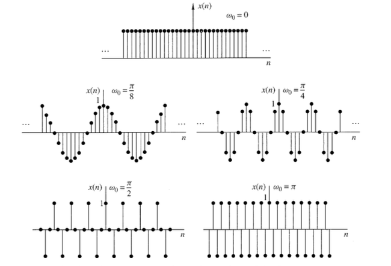
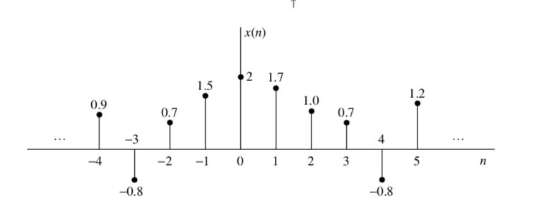
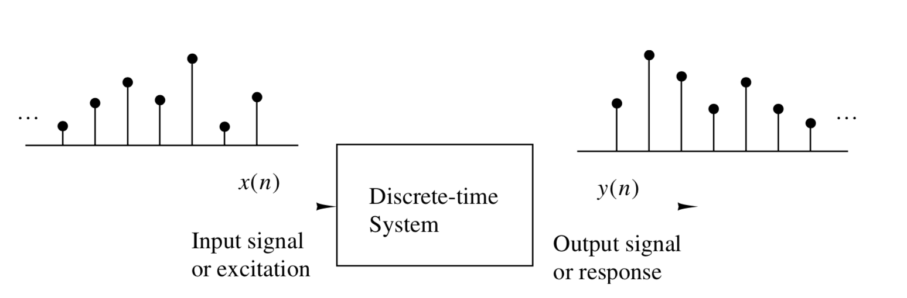

# Apunte Señales y Sistemas I
Por: Tomás Rojas

# Señales, sistemas y procesamiento de señales

> Definición: Una __señal__ es cualquier cantidad física que varia en el tiempo, en el espacio o cualquier otra variable.

Algunos ejemplos de señales pueden ser polinomios que dependan del tiempo o del espacio o cualquier cosa.

Hay señales que pueden ser especificadas de manera funcional (con funciones), pero este no es siempre el caso.

Si tomamos un audio de una charla, no es una señal definida funcionalmente, pero podemos descomponerla en suma de senos y cosenos:

$$\sum_{i=1}^NA_i(t)\sin[2\pi F_i(t)t+\theta_i(t)]$$

Donde $\{A_i\},\{F_i\},\{\theta_i\}$ son conjuntos de Amplitudes, Frecuencias y Fases respectivamente, que bien podrían variar en el tiempo.

Otro ejemplo de señal puede ser un electrocardiograma. Esta señal le entrega información a un médico sobre la condición en que se encuentra el corazón de su paciente. De manera similar, un electroencefalograma da información de la actividad cerebral.

Todos los sistemas mencionados son ejemplos de sistemas que dependen se solo una variable independiente, el tiempo... Un ejemplo de un sistema con más variables independientes puede ser una imagen.

Un sistema también puede ser definido como un aparato físico que ejecuta cierta operación sobre una señal. Por ejemplo un filtro puede ser tratado como un sistema.

Cuando pasamos una señal por un sistema, decimos que la procesamos. En general, un sistema está caracterizado por el tipo de operación que aplica a una señal.

## Clasificación de señales
> lo voy a dejar en blanco ya que no es tan importante para el C1, más adelante volveré a llenar esto

## Señales en tiempo continuo versus señales en tiempo discreto

### Señales sinusoidales continuas

Un oscilador armónico simple puede ser descrito matemáticamente como:

$$x_a(t)=A\cos(\Omega t + \theta); \quad -\infty<t<\infty$$

El subíndice $a$ hace referencia a que esta señal es analógica.

La frecuencia $\Omega$ es frecuencia angular, en radianes, es común usar $F$ que es en Hertz, donde $\Omega=2\pi F$

La señal sinusoidal analógica está caracterizada por las siguientes propiedades:

  + _Para cualquier valor fijo de frecuencia $F$, $x_a(t)$ es periódica._ Esto es
  $$x_a(t+T_p)=x_a(t), \quad T=1/F$$
  + _Señales análogas sinusoidales con distintas frecuencias, __son__ distintas_.
  + _Incrementar la frecuencia implica incrementar las oscilaciones de una señal en un tiempo dado._

Podemos notar que para $F\to 0$ entonces $F \to \infty$

### Señales sinusoidales discretas

Podemos expresar matemáticamente una señal sinusoidal discreta de la siguiente manera:

$$x(n)=A\cos(\omega n + \theta); \quad -\infty<n<\infty$$

Acá también tenemos otra frecuencia:

$$\omega \equiv 2\pi f$$

Podemos ver las siguientes propiedades de este tipo de señales:

  + _Una señal sinusoidal discreta es periódica __solo__ si su frecuencia $f$ es un nro racional_.

Por definición tenemos que una señal discreta es periódica con periodo $N \quad (N>0)$  ssi:
$$x(n+N)=x(n)\quad \forall n$$

El valor más pequeño de $N$ para el que esto se cumple, se llama _periodo fundamental_.

> __Demostración:__
> $$\cos[2\pi f_0(N+n)+\theta]=\cos(2\pi f_0n+\theta)$$
> $$2\pi f_0 N =2k\pi$$
> $$f_0=\frac{k}{N}$$

Por lo que es periódica sólo si su frecuencia $f_0$ es una fracción entre dos enteros i.e. es racional.

  + _Sinusoides discretas cuyas frecuencias están separadas por un múltiplo entero de $2\pi$ son __indénticas__._

Para probar esto, consideremos $\cos(\omega_0n+\theta)$
$$\cos[(\omega_0 +2\pi)n+\theta]=\cos (\omega_0 n + 2\pi +\theta)= \cos(\omega_0n+\theta)$$

Como consecuencia de esto, __todas__ las secuencias sinusoidales que cumplan:

$$x_k(n)=A\cos(\omega_k n+\theta); \quad k=0,1,2,3,...$$

Donde:

$$\omega k =\omega_0+2k\pi, \quad -\pi \leq \omega_0 \leq \pi$$

Son __indistinguibles__, por lo mismo, nos interesan frecuencias en los rangos $-\pi \leq \omega \leq\pi$ o bien $-1/2\leq f\leq1/2$

  + _La oscilación más rápida que puede tener una señal sinusoidal discreta es cuando $\omega=\pm\pi$ o bien $f=\pm 1/2$

En la siguiente imagen podemos ver la señal $x(n)=\cos\omega_0n$ con distintos valores para $\omega_0$

__Figura 1:__ Imagen sacada de _Digital Signal Processing_

## Analógico a digital y digital a analógico

Muchas señales de interés son analógicas. Para procesar una señal analógica de manera digital, primero hay que digitalizarla.

> Esto tampoco es pertinente para el C1, por lo que lo dejaré para después

### Teorema del muestreo

Si tenemos una señal analógica ¿Como encontramos la frecuencia de muestreo $F_s$? Para responder esta pregunta es necesario conocer ciertas características de la señal de interés. En particular, tenemos que tener ciertas nociones del _contenido frecuencial_ de la señal. Por lo general podemos conocer esa información en forma de cotas superiores.

Supongamos que cualquier señal analógica puede ser representada como un suma de senos (Fourier se encarga de eso).

$$x_a(t)=\sum_{i=1}^NA_i\cos(2\pi F_it+\theta_i)$$

Donde $N$ es el número de frecuencias presentes.

El teorema nos dice que (se viene golazo, pero en virtud del tiempo lo voy a plantear no más, en todo caso es fácil de ver que tiene que ver con el aliasing de las señales al tomar mal la frecuencia de muestreo) $F_s>2F_{\text{max}}$

Donde $F_{\text{max}}$ es la frecuencia más alta presente en la señal.

Usando esto, cualquier componente de frecuencia $|F_i|<F_{\text{max}}$, en analógica, pasa a ser una señal sinusoidal discreta con una frecuencia:

$$-\frac{1}{2}\leq f_i=\frac{F_i}{F_s}\leq \frac{1}{2}$$

o de manera equivalente:

$$-\pi\leq \omega_i=2\pi f_i\leq \pi$$
Como $|f|=1/2$ o $|\omega|=\pi$ son las frecuencias más altas en tiempo discreto, si escogemos el muestreo como se mostró, se evita el problema del aliasing.

Así la condición $F_s>2F_{\text{max}}$ garantiza que el mapeo de frecuencias continuas pase con relación 1 a 1 al dominio discreto.

__Teorema del muestreo:__
Si la frecuencia más alta contenida en una señal analógica $x_a(t)$ es $F_{\text{max}}=B$ y la señal se muestrea de tal manera que $F_s>2B$, entonces $x_a(t)$ puede ser recuperada con la función interpolación

$$g(t)=\frac{\sin2\pi B t}{2\pi B t}$$

Así $x_a(t)$ puede ser expresada como:

$$x_a(t)=\sum_{n=-\infty}^\infty x_a\left(\frac{n}{2B}\right)\frac{\sin[ 2 \pi B(t-n/2B)]}{2 \pi B(t-n/2B)}$$

>TODO: Falta poner un par de imágenes

# Señales y sistemas en tiempo discreto

En esta sección se ven mucho los sistemas LTI, tema central del curso.

## Señales en tiempo discreto
Una señal en tiempo discreto $x(n)$ es una función de una variable independiente que es un entero. Como muestra la _figura 2_, la señal __no está definida__ para valores de $n$ que no sean enteros (ni siquiera es 0).

__Figura 2__

## Señales elementales en tiempo discreto

#### 1.- Muestra unitaria

Es una señal que es 1 en 0 pero 0 en todo lo demás

$$\delta(n)=
\begin{cases}
  1, &\quad \text{para } n=0\\
  0, &\quad \text{para } n\neq0
\end{cases}
$$

#### 2.- Señal escalón unitario

$$
u(n)=
\begin{cases}
  1, &\quad \text{para } n\geq 0\\
  0, &\quad \text{para } n<0
\end{cases}
$$

#### 3.- Señal rampa unitaria
$$
u_r(n)=
\begin{cases}
  n, &\quad \text{para } n\geq 0\\
  0, &\quad \text{para } n<0
\end{cases}
$$

#### 4.- Señal exponencial
$$
x(n)=a^n \quad \forall n
$$

A puede ser real o complejo, si usamos propiedades los complejos, tenemos:

$$
x(n)=r^ne^{jn\theta}
$$

Que tiene parte real e imaginaria dadas por la identidad de Euler.

## Clasificación de las señales discretas en el tiempo (energía y potencia)

### Energía de una señal

La energía $E$ de una señal viene dada por:

$$
E\equiv \sum_{n=-\infty}^\infty|x(n)|^2
$$

Usamos el cuadrado de la función ya que esta sirve para señales tanto reales como complejas. La energía de una señal puede o no ser finita. Cuando la energía de una señal es finita, se dice que es una _señal de energía_

Definimos además la energía de una señal en un intervalo finito $-N\leq n \leq N$

$$
E_N\equiv\sum_{n=-N}^N|x(n)|^2
$$

así podemos redefinir la energía como

$$
E\equiv \lim_{N \to \infty} E_N
$$

### Potencia media de una señal

Muchas señales con energía infinita, tienen potencia media finita. La potencia media de una señal discreta se define como:

$$
P=\lim_{N \to \infty} \frac{1}{2N+1}\sum_{n=-N}^N|x(n)|^2
$$

También podemos definir la potencia media como:

$$
P\equiv \lim_{N \to \infty}\frac{1}{2N+1}E_N
$$

### Periodicidad de una señal

Una señal es periódica con periodo $N \quad (N>0)$ ssi:

$$
x(n+N)=x(n) \qquad \forall n
$$

El valor más pequeño de $N$ para el cual lo anterior es válido, se llama el _periodo fundamental de la señal_ Si no hay valor que satisfaga esta relación, entonces se dice que la señal es no-periódica o a-periódica.

La energía de una señal periódica $x(n)$ en un periodo ---Por ejemplo $0\leq n\leq N-1$--- es finita si solo toma valores finitos en el periodo. Por otro lado la potencia media de una señal periódica es finita y es igual a la potencia media de un único periodo. Así si $x(n)$ es una señal periódica con periodo fundamental $N$ y toma valores finitos, tenemos que su potencia está dada por:

$$
P=\frac{1}{N}\sum_{n=0}^{N-1}|x(n)|^2
$$
Así, las señales periódicas son señales de potencia.

### Señales pares e impares

Una señal real $x(n)$ es simétrica o par si:

$$
x(-n)=x(n)
$$
Por otro lado es antisimétrica o impar si:

$$
x(-n)=-x(n)
$$

Notemos que si $x(n)$ es impar, entonces $x(0)=0$

Cualquier señal puede ser construida como una suma de una señal par y una impar.

La función par viene dada por:

$$
x_e(n)=\frac{1}{2}[x(n)+x(-n)]
$$

la impar por:

$$
x_o(n)=\frac{1}{2}[x(n)-x(-n)]
$$

Así:

$$
x(n)=x_e(n)+x_o(n)
$$

## Manipulaciones simples de Señales a tiempo discreto

Acá vamos a ver transformaciones simples de señales

#### Transformación de la variable independiente (tiempo)

Una señal $x(n)$ puede ser trasladada en el tiempo cambiando el argumento $n$ por $n-k$, donde $k$ es un entero. Si es positivo, se traslada hacia la derecha (retardo) si es negativo hacia la izquierda (adelanto).

Otra transformación útil es la de reflexión temporal con respecto al origen, para esto basta con reemplazar el argumento $n$ por $-n$

__Es importante notar que estas operaciones no son conmutativas entre sí.__

### Sistemas en tiempo discreto

Un sistema discreto es uno que recibe una señal discreta y aplica una operación de tal manera que la salida es también una señal discreta, llamada salida o respuesta del sistema.

__Figura 3__: Representación de un sistema discreto

Cuando pasamos una señal $x(n)$ por un sistema, decimos que aplicamos una transformación sobre la entrada para producir la salida $y(n)$. Esta relación se expresa matemáticamente así:

$$
y(n)\equiv \mathcal{T}[x(n)]
$$

donde $\mathcal{T}$ representa la transformación

Hay varias maneras de describir las características de un sistema de operaciones aplicadas a $x(n)$ para producir $y(n)$ Partamos con la descripción entrada-salida.

## Descripción entrada-salida de un sistema

En este caso el sistema se tomo como _caja negra_

$$
x(n) \xrightarrow[\qquad]{\mathcal{T}}y(n)
$$

### Clasificación de sistemas a tiempo discreto

Tanto en el diseño como en el análisis de sistemas, nos interesa ver sus propiedades. Para poder hablar de propiedades de un sistema, estas tienen que satisfacerse para cualquier entrada que le pongamos, de otra manera no podemos hablar de que el sistema posea efectivamente la propiedad.

#### Sistemas estáticos versus sistemas dinámicos

Un sistema se dice _estático_ o _sin memoria_ si la salida del sistema depende a lo más, del input que se está procesando en ese momento dado, esto es, que no está ni ahí con lo que pase antes o después, por eso sin memoria, como mi abuelita. En cualquier otro caso, se dice que el sistema es _dinámico_ o que _tiene memoria_.
Si la salida de un sistema en un tiempo $n$ está totalmente determinada por las muestras de entrada den el intervalo desde $n-N$ a $n$ ($N\geq0$) Se dice que el sistema tiene duración de memoria $N$, si $N=0$ el sistema es estático. Si $N$ es finito, el sistema tiene memoria finita, si $N$ es infinito ---diverge---
, el sistema tiene memoria infinita.

Los sistemas estáticos o sin memoria son descritos en general de la siguiente manera:

$$
y(n)=\mathcal{T}[x(n),n]
$$

#### Sistemas invariantes en el tiempo versus sistemas variantes en el tiempo

Podemos subdividir los sistemas en sistemas variantes e invariantes en el tiempo. Un sistema se dice invariante en el tiempo si su característica entrada-salida no cambia en el tiempo.

> Definición: Un sistema relajado $\mathcal{T}$ es _invariante en el tiempo_ ssi:
> $$
> x(n)\xrightarrow[\quad]{\mathcal{T}}y(n) \implies x(n-k)\xrightarrow[\quad]{\mathcal{T}}y(n-k); \quad \forall \quad x(n),k
> $$

Esta es la prueba que hay que aplicar para saber si un sistema es invariante en el tiempo. Primero excitamos un sistema con una entrada arbitraria y después usamos el operador de desplazamiento temporal.

$$
y(n,k)=\mathcal{T}[x(n-k)]
$$
Si $y(n,k)=y(n-k)$ para cualquier valor de $k$, entonces el sistema __es invariante en el tiempo__.

#### Sistemas lineales versus sistemas no-lineales

Un sistema lineal es aquel que satisface el _principio de superposición_
> Definición: Un sistema es lineal ssi:
> $$
> \mathcal{T}[a_1x_1(n)+a_2x_2(n)]=a_1\mathcal{T}[x_1(n)]+a_2\mathcal{T}[x_2(n)]
> $$
> Para cualquiera entradas y constantes $x_i(n), a_i$ respectivamente.

#### Sistemas causales versus sistemas no-causales

> Definición: Un sistema se dice _causal_ si la salida del sistema para cualquier tiempo $n$ depende solo de entradas presentes y/o pasadas, pero no de futuras. Matemáticamente:
> $$
> y(n)=F[x(n),x(n-1),x(n-2),...]
> $$
> donde $F[\cdot]$ es una función arbitraria.

Si un sistema no cumple con esta condición, se dice que es _no-causal_

#### Sistema estable versus sistema inestable

Kerimoh sistemas estables porque en la práctica son más útiles

> Definición: Un sistema se dice bounded input–bounded output (BIBO) estable ssi toda entrada acotada produce una salida acotada. Matemáticamente:
> $$
> |x(n)|\leq M_x<\infty, \qquad |y(n)|\leq M_y<\infty, \qquad \forall \quad n
> $$
